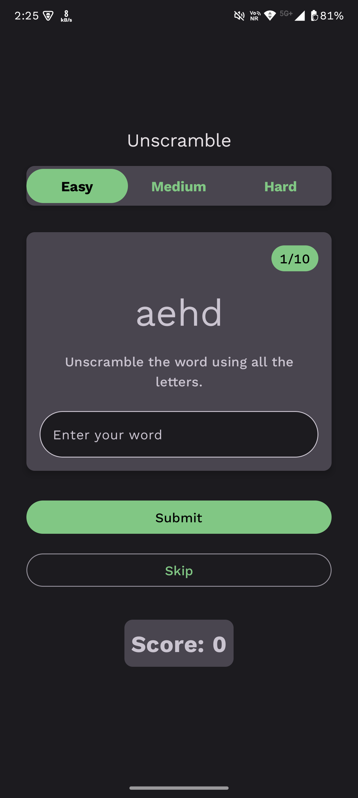
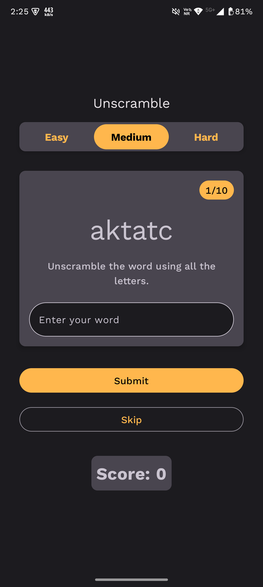
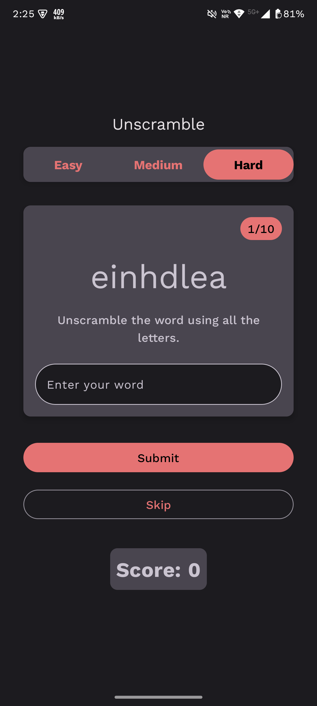

Here’s a well-written, comprehensive **GitHub project description** you can use for your *Unscramble Words* Android app. It includes a professional tone, clearly explains the app's purpose and features, and highlights its unique design aspects.

---

## 📱 Unscramble Words – Android Game App

**Unscramble Words** is a fun and engaging word puzzle game designed for Android devices, where players test their vocabulary and cognitive skills by unjumbling scrambled words within different difficulty levels. It combines brain-training with beautiful visuals and an intuitive UI to provide a rich, immersive gameplay experience.

### 🎮 Game Overview

The core gameplay revolves around displaying a scrambled (jumbled) word and challenging the player to rearrange the letters into a meaningful word. Players earn points for each correct answer and can progress through various levels of increasing difficulty.

This app is suitable for:

* Word game enthusiasts
* Kids and adults looking to improve their vocabulary
* Casual gamers who enjoy brain teasers

### 🔥 Features

* **🧩 Three Difficulty Levels:**

  * **Easy** – Common 3-4 letter words for beginners.
  * **Medium** – 5-6 letter words for intermediate players.
  * **Hard** – 7+ letter challenging words for expert-level players.

* **🎨 Dynamic Theming:**

  * The app theme and colors adapt based on the selected difficulty level.

    * Easy: Light and playful colors
    * Medium: Neutral and balanced tones
    * Hard: Dark and intense color palette
  * This enhances visual engagement and gives a fresh feel across modes.

* **🧠 Points System:**

  * Earn points for each correct word unscrambled.
  * Bonus points for speed and streaks.

* **📱 Beautiful UI & UX:**

  * Clean, minimalistic design.
  * Smooth transitions and animations.
  * Optimized for both phones and tablets.

* **🚀 Lightweight and Fast:**

  * Minimal app size.
  * Loads quickly and runs efficiently on most Android devices.

* **🧩 Replay Value:**

  * Thousands of words in the internal dictionary.
  * Randomized selection ensures a new experience each time.

### 🛠️ Tech Stack

* **Language**: Kotlin / Java
* **Framework**: Android SDK
* **UI Design**: XML + Material Design Components
* **State Management**: ViewModel + LiveData (if used)
* **IDE**: Android Studio

### 📸 Screenshots

  
  
  

